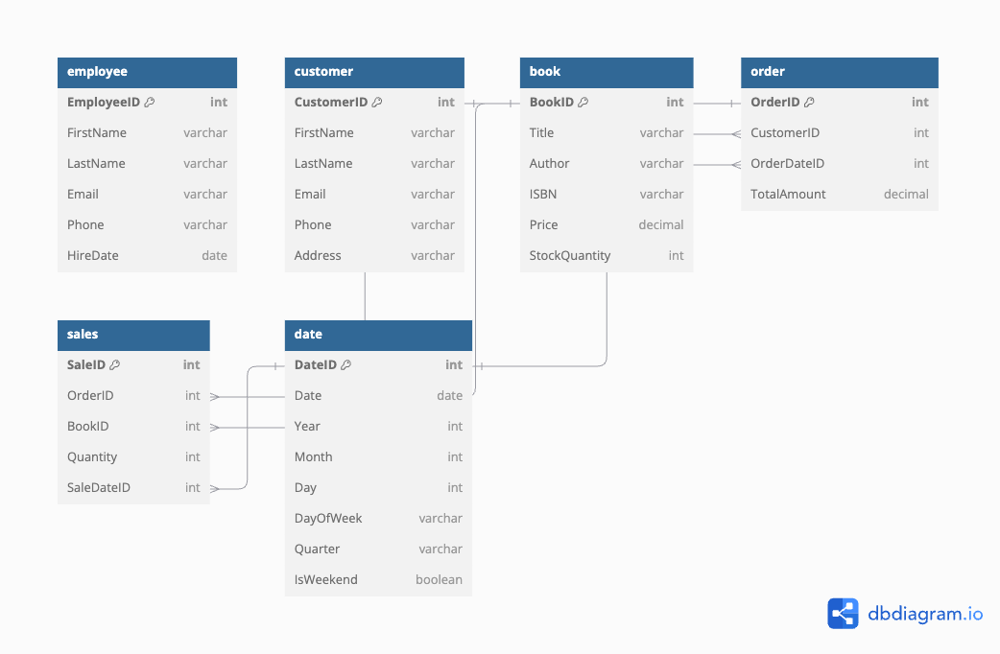
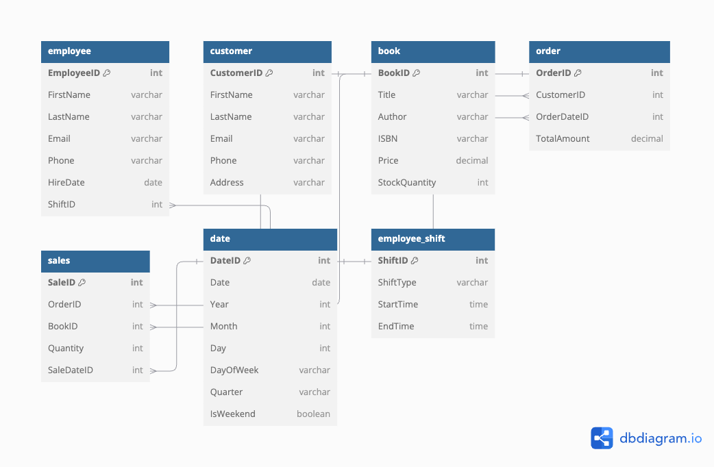

# Assignment 1: Design a Logical Model

## Question 1
Create a logical model for a small bookstore. 📚

At the minimum it should have employee, order, sales, customer, and book entities (tables). Determine sensible column and table design based on what you know about these concepts. Keep it simple, but work out sensible relationships to keep tables reasonably sized. Include a date table. There are several tools online you can use, I'd recommend [_Draw.io_](https://www.drawio.com/) or [_LucidChart_](https://www.lucidchart.com/pages/).

Entity-Relationship Diagram:


## Question 2
We want to create employee shifts, splitting up the day into morning and evening. Add this to the ERD.

Updated Entity-Relationship Diagram:


## Question 3
The store wants to keep customer addresses. Propose two architectures for the CUSTOMER_ADDRESS table, one that will retain changes, and another that will overwrite. Which is type 1, which is type 2?

_Hint, search type 1 vs type 2 slowly changing dimensions._

Bonus: Are there privacy implications to this, why or why not?
```
Architecture Type 1 - Overwrite:
Each time a customer updates their address, the existing address is overwritten. This means we only have one record for the customer's address & will lose historical data.

Example: 
Table customer_address {
  CustomerID [pk]
  AddressLine1 
  AddressLine2 
  City 
  State 
  PostalCode 
  Country 
}

Architecture Type 2 - Keep Changes:
Keeps track of all address changes by creating a new record every time an address is updated. Each record has an effective date and expiration date to  indicate the period during which that record is valid or active.

Example:
Table customer_address {
  AddressID
  CustomerID 
  AddressLine1 
  City 
  Province 
  PostalCode 
  Country 
  EffectiveDate 
  ExpirationDate 
}

BONUS: Type 1 can be an issue if previois addresses are required. Type 2 can have privacy issues regarding old addreses still being accessible which can lead to that data being leaked. It also raises concerns on how long the old data will be stored.

```

## Question 4
Review the AdventureWorks Schema [here](https://i.stack.imgur.com/LMu4W.gif)

Highlight at least two differences between it and your ERD. Would you change anything in yours?
```

Difference 1 - Entities: 
The AdventureWoorks table consists of a largery arry of entities like Vendor, Promotion etc. that allows for more categorization of data. While my Bookstore ERD doesnt have those additional layers of categorization.

Difference 2 - Complexity:
The AdventureWorks schema has more complex relations as compared to my Bookstore ERD that has simpler one-to-many relationsions.

I would like to add more tables to my ERD to manage more many-to-many relations for greater store data managment capabilities. Also, adding more entities like Category for books to better segment the books.

```

# Criteria

[Assignment Rubric](./assignment_rubric.md)

# Submission Information

🚨 **Please review our [Assignment Submission Guide](https://github.com/UofT-DSI/onboarding/blob/main/onboarding_documents/submissions.md)** 🚨 for detailed instructions on how to format, branch, and submit your work. Following these guidelines is crucial for your submissions to be evaluated correctly.

### Submission Parameters:
* Submission Due Date: `September 28, 2024`
* The branch name for your repo should be: `model-design`
* What to submit for this assignment:
    * This markdown (design_a_logical_model.md) should be populated.
    * Two Entity-Relationship Diagrams (preferably in a pdf, jpeg, png format).
* What the pull request link should look like for this assignment: `https://github.com/<your_github_username>/sql/pull/<pr_id>`
    * Open a private window in your browser. Copy and paste the link to your pull request into the address bar. Make sure you can see your pull request properly. This helps the technical facilitator and learning support staff review your submission easily.

Checklist:
- [x] Create a branch called `model-design`.
- [x] Ensure that the repository is public.
- [x] Review [the PR description guidelines](https://github.com/UofT-DSI/onboarding/blob/main/onboarding_documents/submissions.md#guidelines-for-pull-request-descriptions) and adhere to them.
- [x] Verify that the link is accessible in a private browser window.

If you encounter any difficulties or have questions, please don't hesitate to reach out to our team via our Slack at `#cohort-4-help`. Our Technical Facilitators and Learning Support staff are here to help you navigate any challenges.
